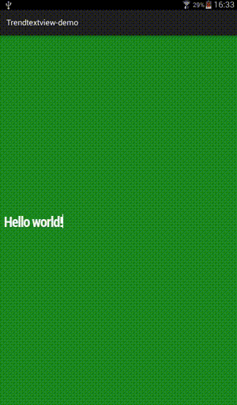

TrendTextView
=====
TrendTextView is an extended TextView component for Android inspired by [Google Trends visualization](http://www.google.com/trends/hottrends/visualize).



##Usage
```java
TrendTextView trendTextView = (TrendTextView) findViewById(R.id.trendTextView);
trendTextView.animateText("Hello world!");
```

##Importing to your project
Add this dependency to your build.gradle file:
```java
dependencies {
    compile 'com.hrules:trendtextview:1.0.0'
}
```

Developed by
-------
Héctor de Isidro - hrules6872 [](http://twitter.com/hector6872)
Check out also the iOS version created by my colleague [alexruperez](https://github.com/alexruperez)/[UILabel-AutomaticWriting](https://github.com/alexruperez/UILabel-AutomaticWriting).

License
-------
    Copyright 2015 Héctor de Isidro - hrules6872

    Licensed under the Apache License, Version 2.0 (the "License");
    you may not use this file except in compliance with the License.
    You may obtain a copy of the License at

       http://www.apache.org/licenses/LICENSE-2.0

    Unless required by applicable law or agreed to in writing, software
    distributed under the License is distributed on an "AS IS" BASIS,
    WITHOUT WARRANTIES OR CONDITIONS OF ANY KIND, either express or implied.
    See the License for the specific language governing permissions and
    limitations under the License.
